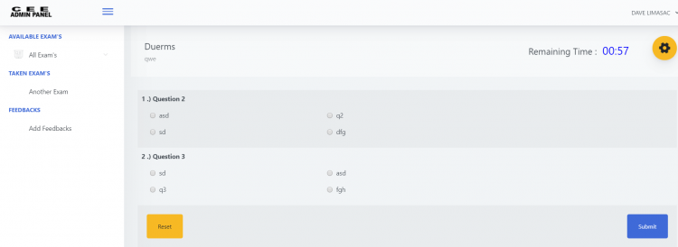

# Online Exam System With Timer using PHP/PDO

 

### Description

This is an Online Exam System with Timer using PHP/PDO. This system helps a certain school to provides their students an online exam platform. The system has 2 types of users which are the Admin and the Students/Examinee. The Admin user will be using the admin panel of the system which they are in charge of populating and maintaining the data of the system.

### Feature 

<strong>Admin Panel</strong>
<ul>
  <li><strong>Manage Courses</strong></li>
  <li><strong>Manage Exams'</strong></li>
  <li><strong>Manage Exam's Questionnaire</strong></li>
  <li><strong>Manage Examinees'</strong></li>
  <li><strong>View Ranking By Exam</strong></li>
  <li><strong>View Examinee Results</strong></li>
  <li><strong>Read Feedbacks</strong></li>
</ul>
<strong>Students/Examinees'</strong>
<ul>
  <li><strong>Take the Exams'</strong></li>
  <li><strong>View their Results</strong></li>
  <li><strong>Send a Feedback</strong></li>
</ul>

Visit [sourcecodester.com](https://www.sourcecodester.com/php/13877/online-exam-timer.html) for more detailed information about this Online Exam System Project.

### Website Info

| Title | Online Exam System With Timer using PHP/PDO with Source Code |
|:--|:--|
| Website | [www.sourcecodester.com](https://www.sourcecodester.com) |
| Link | https://www.sourcecodester.com/php/13877/online-exam-timer.html |
| Language | PHP |
| Uploader/Developer | [rogz.sourcecodester](https://www.sourcecodester.com/users/rogzsourcecodester) |
